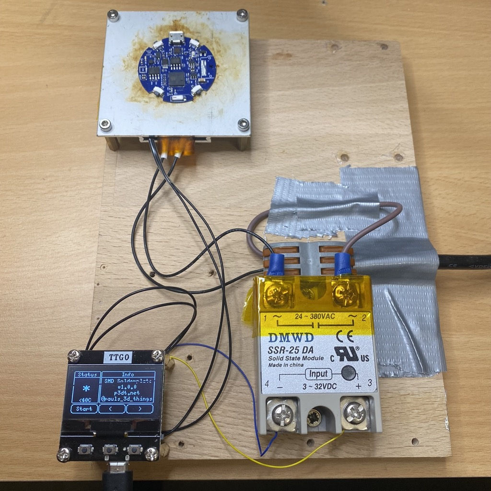
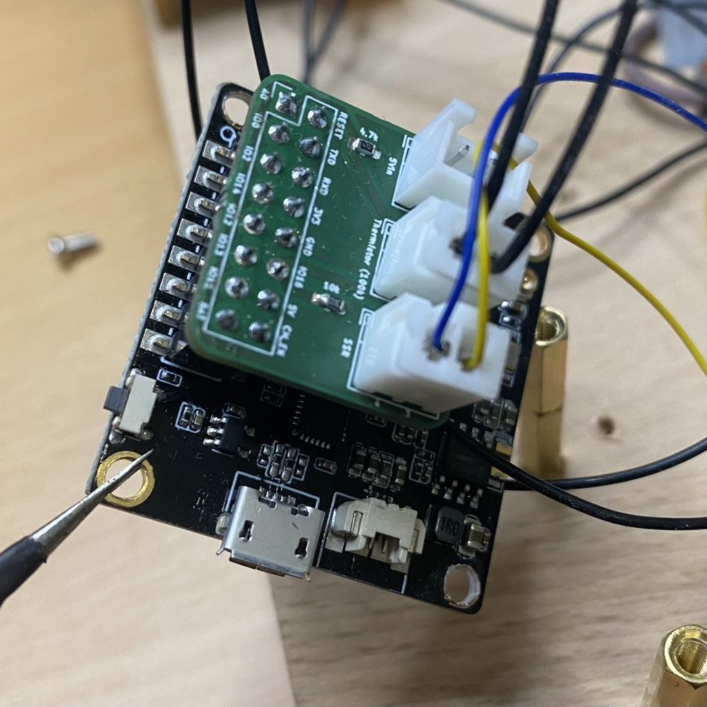

# SMD Soldering Station / Hotplate

**WARNING! If you no experience wiring mains, do not proceed with this project. USE THIS INFORMATION YOUR OWN RISK!!**

## Support my projects ❤️

It takes me countless hours to prepare and document my projects. [You can support me by reading/recommending my books.](https://p3dt.net/books.html) Thank you!

## Introduction

This is a project to build a DIY PID controlled hotplate. This includes a python script to create a temperature chart and a tiny PCB to extend a TTGO 1.3" OLED shield as a controller.

- ESP8266 OLED board: https://www.aliexpress.com/item/32854542718.html
- SMD Hot plate, maybe something like this: https://www.aliexpress.com/item/1005003120565125.html
- SSR-25 DA Solid State Module
- Hot plate adapter board: see `hardware/` for KiCAD sources, or order here: https://aisler.net/p/AJJEAEVL
- 1x4.7k, 1x10k 0603 resitor
- 1x100k Thermistor (from my 3D printer)
- 2x8pin female header
- 3x2pin JST-XH 2.50mm
- Code: see `software/`

## software

The trickiest part was to get the temperature readings correct.
I had the best results using the *Stein-Hart* model to obtain correct temperature readings (which only works above 40C, but as we want to solder somethings, this should be OK ;) ). If you are using a different setup, you will need to adapt the line in `main.cpp`, using values derived with this tool: https://www.thinksrs.com/downloads/programs/therm%20calc/ntccalibrator/ntccalculator.html

```c++
SteinhartHart sh(SENSOR_PIN, 4700, 1.719817401e-3, 0.3527370551e-4, 10.70472184e-7);
```

The software has two modes: constant temperature and reflow. You can adapt the reflow curve by changing the setup code. The constructor takes the *label of the phase*, *the temperature in C*, *how long to hold the temperature in millis*, and *the kP* factor (higher value = more agressive heating = overshooting). I've set the *kP* high to quickly reach the max temp at end of the reflow phase:

```c++
void setupTempControl() {
  tempControl.add(new TempStep("heatup", HEATUP, 120, 1 * 1000, 1.0));
  tempControl.add(new TempStep("soak", HEATUP, 150, 80 * 1000, 1.5));
  tempControl.add(new TempStep("reflow", HEATUP, 230, 1 * 1000, 3.0));
  tempControl.add(new TempStep("reflow", HEATUP, 245, 3 * 1000, 10.0));
  tempControl.add(new TempStep("cooldown", COOLDOWN, 50, 10 * 1000));
}
```


## hardware

The overall setup *could* look like this, the setup below is only for educational purposes:



**DO NOT LEAVE THE MAINS VOLTAGE TERMINALS EXPOSED!!**

I used the following adapter to connect everything to the EPS8266 board:



The schematics:


## serial-plotter


Requires Python

```bash
pip3 install matplotlib
pip3 install pyserial
```

Usage:

```bash
python3 main.py /dev/cu.usb... 115200
```


### On Error: can't import serial

If the `import serial` fails

```bash
pip3 uninstall serial
pip3 uninstall pyserial

pip3 install pyserial
```
